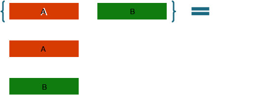

# Exploring C# 8 New Language Features

## Welcome

### AuthorFirst AuthorLast

* ☁️ Qualification
* ☁️ Qualification

<https://social-media.link>

### Agenda

* [C# Versions](#c-versions)
* [C# Member Enhancements](#c-member-enhancements)
* [Pattern Matching](#pattern-matching)
* [C# Expression Enhancements](#c-expression-enhancements)

## C# Versions

### C# beginnings

* Originally released as part of **Visual Studio .NET 2002**
* Was very similar to Java in syntax
* Had the *basic build blocks* of an [object-oriented programming language](https://wikipedia.org/wiki/Object-oriented_programming)

### C# 2 - 4

* Introduced more advanced features
  * Generics
  * Anonymous members and types
  * Nullable types
  * Iterators
  * Lambda Expressions
  * Dynamic
  * Interop

### C# 5

* Introduced language-native asynchronous keywords (``async``/``await``)
* Introduced Task-based asynchronous programming

### C# 6

* Added many quality-of-life features
  * Advanced exception filter syntax
  * Auto-initialized properties
  * Members with expression bodies
  * String interpolation
  * Null conditionals
* Released side-by-side with Visual Studio 2015
* **Roslyn** meant that C# was now compiled using C#
  * The rate of progress can now grow exponentially
* 👉 Many C# developers are **here**

### C# 7 & 8

* Out variables
* Tuples
* Discards
* Local functions
* Async Main methods
* Pattern matching
* Default interface implementations
* Using delcarations
* Async streams
* ...and more...

### Our Goals

* Cover many of the enhancements in C# 7 & 8
* Use these new enhanced features side-by-side with language features from C# 6 and before

## C# Member Enhancements

### Synchronous Main Entry Point

```csharp
static void Main(string[] args)
{
    Console.WriteLine("Hello World!");
}
```

::: notes

Static, synchronous method with arguments

:::

### Calling Async Methods from Main

```csharp
static void Main(string[] args)
{
    var task = new Library().DoSomething();

    task.Wait();

    var result = task.Result;
}
```

### Calling More Than One Async Method

```csharp
static void Main(string[] args)
{
    var taskOne = new Library().DoSomething();

    var taskTwo = new Library().DoSomethingElse();

    Task.WaitAll(taskOne, taskTwo);

    var resultOne = taskOne.Result;

    var resultTwo = taskTwo.Result;
}
```

### Refactor Async Calls To Another Method

```csharp
static void Main(string[] args)
{
    Console.WriteLine("Hello World!");
    AsyncCalls().Wait();
}

static async Task AsyncCalls()
{
    var resultOne = await new Library().DoSomething();

    var resultTwo = await new Library().DoSomethingElse();
}
```

### Async Main Entry Point

```csharp
static async Task Main(string[] args)
{
    Console.WriteLine("Hello World!");

    var resultOne = await new Library().DoSomething();

    var resultTwo = await new Library().DoSomethingElse();
}
```

### Async Main Advantages

* Many cloud SDKs/libraries are asynchronous by default
* Reduces the complexity of your **Program.cs** file

### ASP.NET Bootstrap - Synchronous (default)

```csharp
public static void Main(string[] args)
{
    Host.CreateDefaultBuilder(args)
        .ConfigureWebHostDefaults(webBuilder =>
        {
            webBuilder.UseStartup<Startup>();
        })
        .Build()
        .Run();
}
```

### ASP.NET Bootstrap - Asynchronous

```csharp
public static async Task Main(string[] args)
{
    await Host.CreateDefaultBuilder(args)
        .ConfigureWebHostDefaults(webBuilder =>
        {
            webBuilder.UseStartup<Startup>();
        })
        .Build()
        .RunAsync();
}
```

### Interfaces and Implementations

* Typically, must implement **all** members of an interface
* What if you wanted to ship a default implementation with the interface?
  * Useful if you need to add members to an in-use interface

### Example Interface

```csharp
public interface IPerson
{
    string FirstName { get; }

    string LastName { get; }
}
```

### Default Interface Member Implementations

```csharp
public interface IPerson
{
    string FirstName { get; }

    string LastName { get; }

    string GetFullName() {
        return $"{FirstName} {LastName}";
    }
}
```

### Example Interface Class Implementation

```csharp
public class User : IPerson
{
    public string FirstName { get; set; }

    public string LastName { get; set; }
}
```

### Usage

```csharp
IPerson me = new User { FirstName = "Sidney", LastName = "Andrews" };
Console.WriteLine(me.GetFullName());
```

### Local Functions

Methods declared within the context of another method
Ideal for units of logic only called from within the current method
Used commonly to separate parameter validation from method implementation

::: notes

<https://docs.microsoft.com/dotnet/csharp/whats-new/csharp-7#local-functions>

:::

### Example Method

```csharp
public string ConcatenateNumbers(params int[] values)
{
    if (values.Count() == 0)
        throw new ArgumentException(nameof(values));

    return $"[{String.Join(", ", values)}]";
}
```

### Example Local Functions

```csharp
public string ConcatenateNumbers(params int[] values)
{
    if (!CheckNumbers())
        throw new ArgumentException(nameof(values));

    return CombineNumbers();

    string CombineNumbers()
    {
        return $"[{String.Join(", ", values)}]";
    }

    bool CheckNumbers()
    {
        return values.Count() > 0;
    }
}
```

### Static Local Functions

```csharp
public string ConcatenateNumbers(params int[] values)
{
    if (!CheckNumbers(values))
        throw new ArgumentException(nameof(values));

    return CombineNumbers(values);

    static string CombineNumbers(int[] values)
    {
        return $"[{String.Join(", ", values)}]";
    }

    static bool CheckNumbers(int[] values)
    {
        return values.Count() > 0;
    }
}
```

::: notes

The local function can be static since it doesn’t access any variables in the enclosing scope.

This example is functionally identical.

:::

### Static Local Function in Main

```csharp
static void Main(string[] args)
{
    Console.WriteLine(GetGreeting(args.FirstOrDefault()));

    static string GetGreeting(string name)
    {
        return $"Hello, {name ?? "Person"}!";
    }
}
```

### Property Initialization

* Very common to need default values for our properties
* Many times, we may have read-only properties that are only set in the constructor of our class

### Example Property Initialization

```csharp
public class User
{
    private string _domain = "github.com";

    string Domain {
        get { return _domain; }
    }
}
```

### Example Alternate Property Initialization

```csharp
public class User
{
    string Domain { get; }

    public User()
    {
        Domain = "github.com";
    }
}
```

### Auto-Property Initializers

* Declare an initial value for a property as part of the property declaration
  * Removes extra code necessary to initialize properties in the constructor

::: notes

<https://docs.microsoft.com/dotnet/csharp/whats-new/csharp-6#auto-property-initializers>

:::

### Example Auto-Property Initialization

```csharp
public class User
{
    string Domain { get; }  = "github.com";
}
```

### Expression-Bodied Members

* Use **lambda syntax** to define the body of a member
  * Methods
  * Properties
  * Constructors
  * Get/Set Accessors
  * Finalizers (Garbage Collection)

### Expression-Bodied Properties

```csharp
public class User
{
    public string FirstName { get; set; }

    public string Domain { get; set; }

    public string Email => $"{FirstName}@{Domain}";
}
```

### Expression-Bodied Methods

```csharp
public class User
{
    public string FirstName { get; set; }

    public string Domain { get; set; }

    public override string ToString() =>
        $"{Domain}//{FirstName}";
}
```

### Expression-Bodied Constructor

```csharp
public class User
{
    public string FirstName { get; set; }

    public string Domain = "SKILLMEUP.COM";

    public User(string firstName) =>
        FirstName = firstName;
}
```

### Expression-Bodied Accessors

```csharp
public class User
{
    private string _firstName;

    string FirstName
    {
        get => _firstName;
        set => _firstName = value ?? "STUDENT";
    }
}
```

### Expression-Bodied Main Entry Point

```csharp
static void Main(string[] args) =>
    Console.WriteLine("Hello, World!");
```

### Expression-Bodied ASP.NET Bootstrap

```csharp
public static async Task Main(string[] args) =>
    await Host.CreateDefaultBuilder(args)
        .ConfigureWebHostDefaults(webBuilder =>
        {
            webBuilder.UseStartup<Startup>();
        })
        .Build()
        .RunAsync();
```

### Tuples

* Types defined in a lightweight syntax
* Supported for a long time but the syntax was recently improved



### Classic Tuple Syntax

```csharp
private Tuple<string, int> GetRoom()
{
    return new Tuple<string, int>("Breakout", 234);
}

var room = GetRoom();

Console.WriteLine($"Room: {room.Item1}");
Console.WriteLine($"Number: {room.Item2}");
```

### Improved Tuple Syntax

```csharp
private (string, int) GetRoom()
{
    return ("Breakout", 234);
}

(string name, int number) room = GetRoom();

Console.WriteLine($"Room: {room.name}");
Console.WriteLine($"Number: {room.number}");
```

### Tuple Name Inference

```csharp
string name = "Breakout";
int number = 234;

var room = (name, number);

Console.WriteLine($"Room: {room.name}");
Console.WriteLine($"Number: {room.number}");
```

### Tuple Explicit Naming

```csharp
(string first, string last) person = ("Sidney", "Andrews");

string fullname = $"{person.first} {person.last}";
```

### Tuple Explicit Naming (cont.)

```csharp
var person = (first: "Sidney", last: "Andrews");

string fullname = $"{person.first} {person.last}";
```

### Tuple decomposition

```csharp
private (string, int) GetRoom()
{
    return ("Breakout", 234);
}

(string name, int number) = GetRoom();

Console.WriteLine($"Room: {name}");
Console.WriteLine($"Number: {number}");
```

### Discards

* Dummy variables that are intentionally unused
  * Equivalent to variables that were never assigned
* Uses a special character as its name


### Using a Discard with a Tuple

```csharp
private (string, int) GetRoom()
{
    return ("Breakout", 234);
}

(_, int number) = GetRoom();

Console.WriteLine($"Number: {number}");
```

::: notes

Here, we don't need the room name so the code discards it immediately.

:::

## Demo: Building Classes Using Tuples

::: notes

TBD

:::

## Pattern Matching

* **Test** that a value has a certain schema (*or shape*)
* If the value "matches", then **extract** information
* All about improving the syntax for common checks

### Casting Values and the "is" Keyword

```csharp
if (shape is Rectangle)
{
    var r = shape as Rectangle;
    return r.HorizontalSide * r.VerticalSide;
}
else if (shape is Circle)
{
    var c = shape as Circle;
    return c.Radius * c.Radius * Math.PI;
}
else
{
    throw new ArgumentException("Shape not found", nameof(shape));
}
```

### Pattern Matching and "is" Keyword

```csharp
if (shape is Rectangle r)
    return r.HorizontalSide * r.VerticalSide;
else if (shape is Circle c)
    return c.Radius * c.Radius * Math.PI;
else
    throw new ArgumentException("Shape not found", nameof(shape));
```

### Pattern Matching and Switches

* Pattern matching changes functionality of a statement based on characteristics of the data
* Use matching with switch statements to build more concise “filters”

### Switch Syntax

```csharp
switch (shape)
{
    case Rectangle r:
        return r.HorizontalSide * r.VerticalSide;
    case Circle c:
        return c.Radius * c.Radius * Math.PI;
    default:
        throw new ArgumentException("Shape not found", nameof(shape));
}
```

### Pattern Matching Switch Syntax

```csharp
double area = shape switch
{
    Rectangle r => r.HorizontalSide * r.VerticalSide,
    Circle c => c.Radius * c.Radius * Math.PI,
    _ => throw new ArgumentException("Shape not found", nameof(shape))
};
```

### When Clauses

```csharp
double area = shape switch
{
    Rectangle r when r.HorizontalSide == 0 || r.VerticalSide == 0 => 0,
    Circle c when c.Radius == 0 => 0,
    Rectangle r => r.HorizontalSide * r.VerticalSide,
    Circle c => c.Radius * c.Radius * Math.PI,
    _ => throw new ArgumentException("Shape not found", nameof(shape))
};
```

### Example Enum

```csharp
public enum Location
{
    FloorOne = 0,
    FloorTwo,
    FloorThree
}
```

### Pattern Matches Switch Statement for Enum

```csharp
Location loc = Location.FloorTwo;

string location = loc switch
{
    Location.FloorOne => "Main Lobby",
    Location.FloorTwo => "Guest Rooms",
    Location.FloorThree => "Penthouse Suite",
    _ => "Not Found"
};

Console.WriteLine($"Location: {location}");
```

### Sample Class

```csharp
public class Student
{
    public string Name { get; set; }

    public double GPA { get; set; }
}
```

### Property Patterns

```csharp
Student student = new Student { Name = "Savannah" };

int grade = student switch
{
    { Name: "Jaiden" } => 90,
    { Name: "Jackson" } => 70,
    { Name: "Savannah" } => 85,
    _ => throw new ArgumentNullException(nameof(student))
};

Console.WriteLine($"{student.Name}'s Math Grade: {grade}");
```

### Tuple Patterns

```csharp
(string first, string last) = ("Jaiden", "Ashby");

string greeting = (first, last) switch
{
    ("Jaiden", _) => "Student of the year, Jaiden!",
    (_, "Andrews") => "Mr. Andrews",
    (_, _) => String.Empty
};

Console.WriteLine(greeting);
```

### Sample Types

```csharp
public enum Group
{
    Unknown = 0,
    UpperElementary,
    LowerElementary
}

public class Student
{
    public string FullName { get; set; }

    public int GradeLevel { get; set; }

    public void Deconstruct(out string name, out int grade)
    {
        name = FullName;
        grade = GradeLevel;
    }
}
```

### Sample Types (Improved)

```csharp
public enum Group
{
    Unknown = 0,
    UpperElementary,
    LowerElementary
}

public class Student
{
    public string FullName { get; set; }

    public int GradeLevel { get; set; }

    public void Deconstruct(out string name, out int grade) =>
        (name, grade) = (FullName, GradeLevel);
}
```

### Deconstruction

```csharp
var student = new Student { FullName = "Jaiden Ashby", GradeLevel = 5 };

Group group = student switch
{
    var (_, grade) when grade >= 3 => Group.UpperElementary,
    var (_, grade) when grade <= 2 => Group.LowerElementary,
    _ => Group.Unknown
};
```

## Demo: Parsing, Categorizing, and Handling Data

::: notes

TBD

:::

## C# Expression Enhancements

### Using Keyword Enhancements

* Using Declarations
* Using Static

### Using Declarations

* Variable declaration that is disposed at the end of the enclosing scope
* Removes some of the extra syntax required with a traditional using statement

::: notes

<https://docs.microsoft.com/dotnet/csharp/whats-new/csharp-8#using-declarations>

:::

### Classic Using Statements

```csharp
using System.IO;

public void ReadContentFromFile()
{
    using (var stream = File.OpenRead(@"D:\sys.log"))
    {
        // Perform operations here
    }
}
```

### Using Declarations Example

```csharp
using System.IO;

public void ReadContentFromFile()
{
    using var stream = File.OpenRead(@"D:\sys.log")
    // Perform operations here
}
```

::: notes

Disposal occurs at the end of the enclosing scope

:::

### Using Static

* Allows access to static members and child (nested) types without strictly specifying the root type name
  * Special directive
  * Typically included at the top of the code file

::: notes

<https://docs.microsoft.com/dotnet/csharp/language-reference/keywords/using-static>

:::

### Statically using Directory Methods

```csharp
using static System.IO.Directory;

public class Program
{
    public bool LogDirectoryAvailable()
    {
        return Exists("C:\Logs");
    }
}
```

::: notes

[string System.IO.Directory.Exists](https://docs.microsoft.com/dotnet/api/system.io.directory.exists?view=net-5.0)

:::

### Statically using File Methods

```csharp
using static System.IO.File;

public class Program
{
    public string GetLogContent()
    {
        return ReadAllText("C:\Logs\server.txt");
    }
}
```

::: notes

[string System.IO.File.ReadAllText(string filename)](https://docs.microsoft.com/dotnet/api/system.io.file.readalltext?view=net-5.0)

:::

### Statically using Math Methods

```csharp
using static System.Math;

public class Program
{
    public double GetSquare(double number)
    {
        return Pow(number, 2);
    }
}
```

::: notes

[double System.Math.Pow(double number, double power)](https://docs.microsoft.com/dotnet/api/system.math.pow?view=net-5.0)

:::

### Async Enumerables

### Foreach with Async

```csharp
foreach (var device in devices)
{
    (double lat, double lon) = await device.GetReadingAsync();
    Console.WriteLine($"Latitude: {lat} | Longitude: {lon}");
}
```

### Implementing IAsyncEnumerable

```csharp
async IAsyncEnumerable<(double, double)> GetReadingsAsync(IEnumerable<Device> devices)
{
    foreach (var device in devices)
    {
        yield return await device.GetReadingAsync();
    }
}
```

### Await Foreach

```csharp
await foreach ((double lat, double lon) in GetReadingsAsync(devices))
{
    Console.WriteLine($"Latitude: {lat} | Longitude: {lon}");
}
```

### Await Foreach (Entity Framework)

```csharp
var orders = context.Orders
    .Where(o => o.Status == OrderStatus.Pending)
    .OrderByDescending(o => o.SubmittedDate);

await foreach(var order in orders.AsAsyncEnumerable())
{
    // Perform logic
}
```

### Array Ranges

* Simple syntax to get a subset of an array
* Syntax can start from the beginning index or end index
  * You can also use the range operator (..) to create open-ended ranges
* Can also be used on Span<> and ReadOnlySpan<>

### Sample Array

```csharp
string[] phonetic =
{
    "Alfa", "Bravo", "Charlie", "Delta",
    "Echo", "Foxtrot", "Golf", "Hotel",
    "India", "Juliett", "Kilo", "Lima",
    "November", "Oscar", "Papa", "Quebec",
    "Romeo", "Sierra", "Tango", "Uniform",
    "Victor", "Whisket", "X-Ray", "Yankee",
    "Zulu"
};
```

### Closed Range Syntax

```csharp
string[] m_thru_s = phonetic[12..19];

string[] a_thru_e = phonetic[0..5];

string[] u_thru_z = phonetic[20..26];
```

### Open-Ended Range Syntax

```csharp
string[] v_to_end = phonetic[21..];

string[] start_to_g = phonetic[..7];
```

### End Range Syntax

```csharp
string z_to_end =

string[] q_to_x = phonetic[^10..^2];

string[] t_to_end = phonetic[^7..];

```

### Range Variables

```csharp
Range start_to_m = ..13;

string[] frontHalfAlphabet = phonetic[start_to_m];

Range n_to_end = ^13..;

string[] backHalfAlphabet = phonetic[n_to_end];
```

### Null Coalescing Operator

* Performs a null check and returns an operand based on the result
  * If the checked value is null, return the right-hand operand
  * If the checked value is not null, return the left-hand operand


::: notes

<https://docs.microsoft.com/dotnet/csharp/language-reference/operators/null-coalescing-operator>

:::

### Checking for Null Values

```csharp
int? result = null;

Console.WriteLine(result ?? "No Result");

string response = null;

Console.WriteLine(response ?? String.Empty);
```

### Ternary Conditional Operator

* Evaluates a Boolean expression and evaluates one of two expressions based on the result
  * If the checked value is true, evaluates the left-side expression (consequent)
  * If the checked value is false, evaluates the right-side expression (alternative)
* Expressions must evaluate to the same type
* Can be nested multiple times


::: notes

<https://docs.microsoft.com/dotnet/csharp/language-reference/operators/conditional-operator>

is this condition true ? yes : no

:::

### Checking Conditions

```csharp
true ? "Returned Value" : "Not Returned"

bool isAvailable = false;
bool hasBackup = true;

isAvailable ? "☑☑" : hasBackup ? "❎☑" : "❎❎";

isAvailable ? "☑☑" : (hasBackup ? "❎☑" : "❎❎");
```

::: notes

The operator is right-associative. That means the last two expressions are equivalent

:::

### Conditional Member Access

* Tests the left-hand operand for null
  * If null, short-circuits execution and returns null
  * If not null, perform member access
* More concise syntax for null checks
* Can be chained
  * Will short-circuit on first null value


::: notes

<https://docs.microsoft.com/dotnet/csharp/language-reference/operators/null-conditional-operators>

:::

### Conditonally Accessing Properties

```csharp
string firstName = student?.FirstName;

string firstName = student?.Name?.First;

bool result = student?.Enroll("CSC 100", "Fall 2035");
```

### Conditional Array Access

* Similar to conditional member access
* Can be used in a chain with member access


::: notes

<https://docs.microsoft.com/dotnet/csharp/language-reference/operators/null-conditional-operators>

:::

### Conditionally Accessing Index

```csharp
var student = students?["demo-student-1345"];

var name = students?["demo-student-1345"]?.FirstName

var firstStudent = course?.Students[0]?.Name?.First;

var id = universities?[0].Courses?[0]?.Identifier;
```

### Null Coalescing Assignment

* Used to assign the right-hand value to the left-hand conditionally
  * Only if the left-hand currently evaluates to null
* If left-hand is non-null, the right-hand is not evaluated


::: notes

<https://docs.microsoft.com/dotnet/csharp/language-reference/operators/null-coalescing-operator>

:::

### Null Coalescing Assignment Example

```csharp
IEnumerable<int> numbers = null;

numbers ??= Enumerable.Empty<int>();

int count = numbers.Count();
```

## Demo: Authoring a Useful Library Class

::: notes

TBD

:::

## Wrapping-up

### What we covered

* [C# Versions](#c-versions)
* [C# Member Enhancements](#c-member-enhancements)
* [Pattern Matching](#pattern-matching)
* [C# Expression Enhancements](#c-expression-enhancements)

### Where to learn more

<https://dotnet.microsoft.com/>

## Thank you
